# 🚀 AWS Full VPC Project Documentation

## 🧠 About the Project

This is a real-world hands-on project to build a secure, scalable AWS infrastructure. The goal is to host a sample webpage using private EC2 instances and expose it to the internet using a Load Balancer. The setup uses multiple Availability Zones, private/public subnets, NAT Gateways, Auto Scaling Groups, and a Jump Host for secure access.

This kind of architecture is often used in production-level deployments to ensure high availability, fault tolerance, and security.


---

## 🧰 What Was Used

* Custom VPC with custom IP range
* 2 Availability Zones (AZ A and AZ B)
* 2 Public subnets (one per AZ)
* 2 Private subnets (one per AZ)
* 2 NAT Gateways (placed in public subnets)
* Launch Template + Auto Scaling Group
* EC2 instances (2 private, 1 jump host public)
* Application Load Balancer (ALB)
* Python web server (SimpleHTTPServer)

---

## 🔨 Let’s Create It

### 🔸 VPC Creation

* Created a VPC with a custom IP range.
* Inside the VPC:

  * AZ A:

    * 1 Public Subnet
    * 1 Private Subnet
  * AZ B:

    * 1 Public Subnet
    * 1 Private Subnet
* Created 1 NAT Gateway in each public subnet (1 for each AZ).

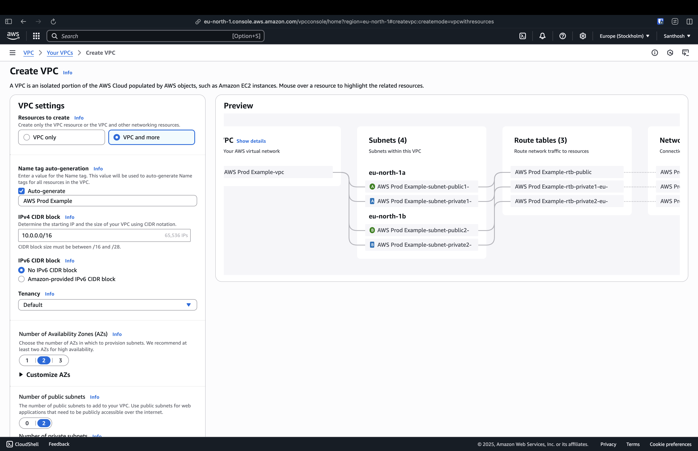
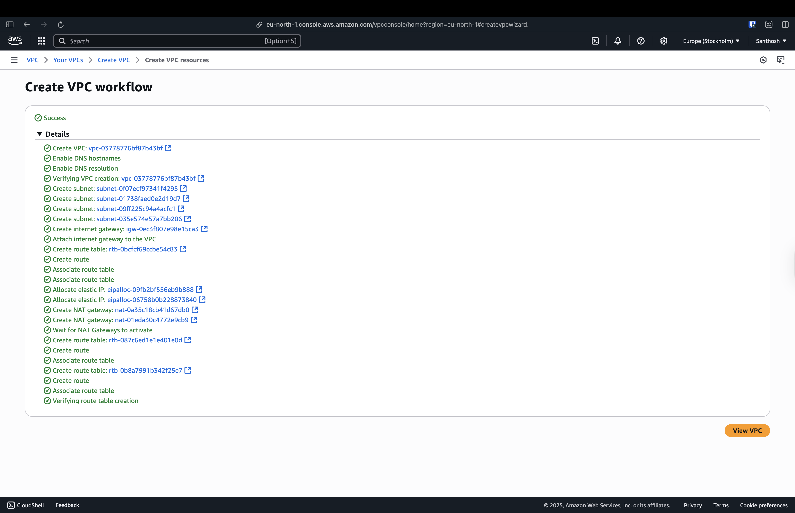

### 🔸 Launch Template & Auto Scaling Group

* Created a **Launch Template** with a basic Ubuntu AMI and default instance configuration.

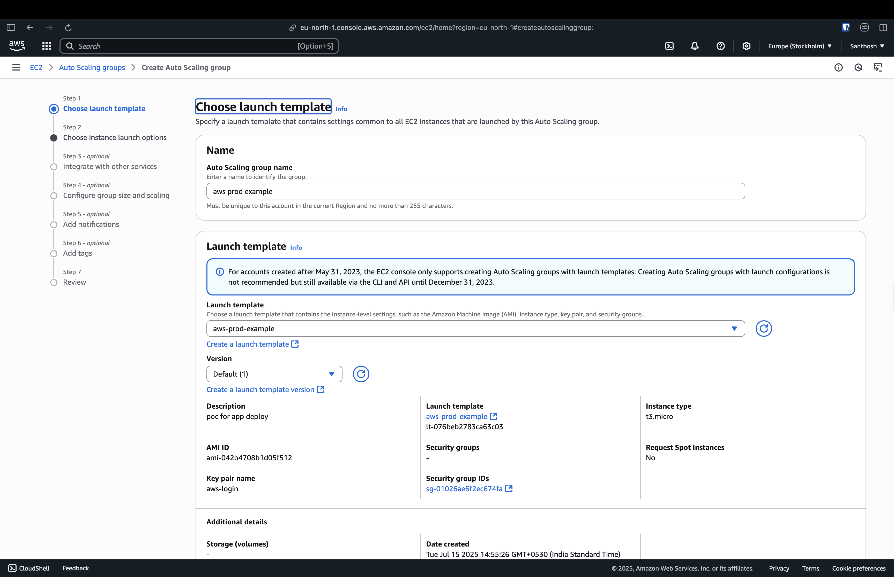

* Created an **Auto Scaling Group** using that template:

  * Minimum and desired capacity set to 2 instances
  * Spread across AZ A and AZ B
  * Launched 1 EC2 in each AZ
  * These EC2s are placed inside **private subnets**, so they don’t have public IPs

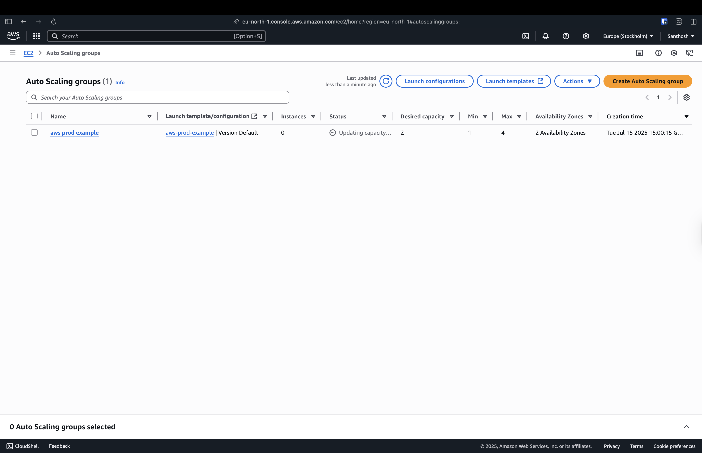
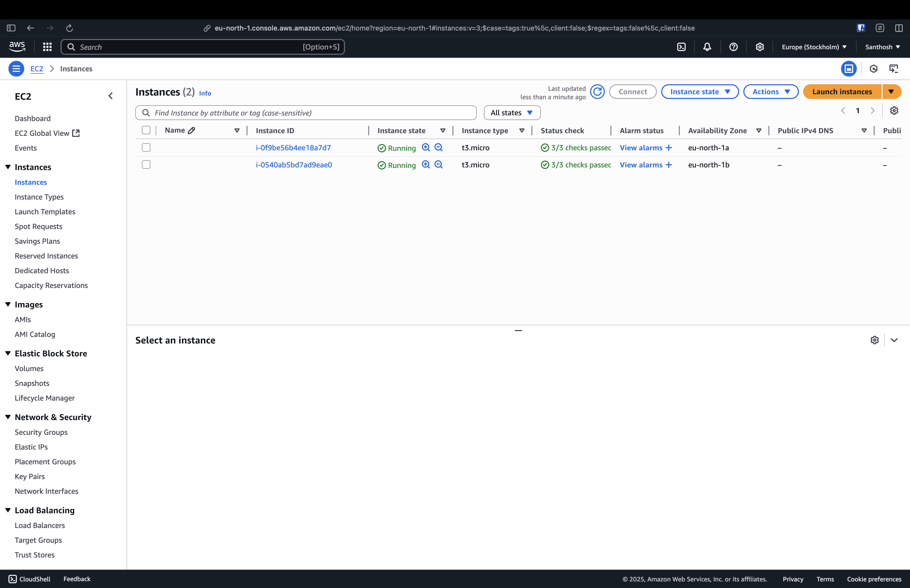

---

## 🔐 Setting Up Jump Host

Since the private EC2 instances have no public IP, we can’t SSH into them directly. So we use a **Jump Host (Bastion Host)**:

* Created a new EC2 instance in the **public subnet** of the same VPC
* Allowed **port 22 (SSH)** in its Security Group

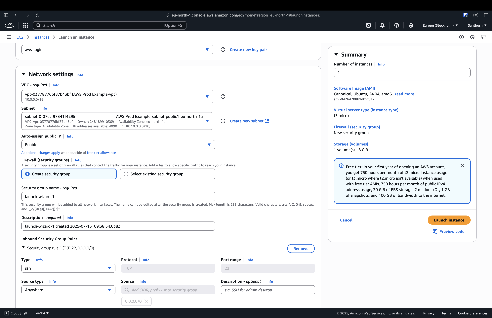


* Used the command below to copy my `.pem` file to the jump host:

```bash
scp -i /Users/santhoshkumarchintada/Downloads/aws-login.pem \
/Users/santhoshkumarchintada/Downloads/aws-login.pem \
ubuntu@13.61.142.208:/home/ubuntu
```


* Then SSH’d into the Jump Host:

```bash
ssh -i aws-login.pem ubuntu@13.61.142.208
```


* From there, used the copied key to connect to the private EC2s (successfully ✅)


---

## 🌐 Web Server on Private EC2

* Logged into the EC2 in **AZ A** and started a simple HTTP server:

```bash
python3 -m http.server 8000
```


* This server was **not deployed** on AZ B intentionally to simulate a failed target.

---

## ⚖️ Creating the Load Balancer

* Created an **Application Load Balancer**:

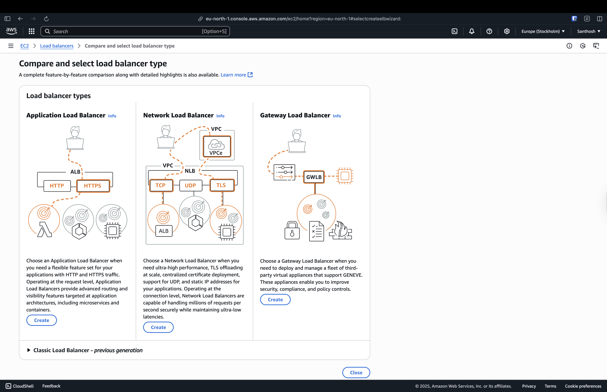

* Selected the same VPC
* Selected both AZs and their subnets
* Created a new **Target Group**

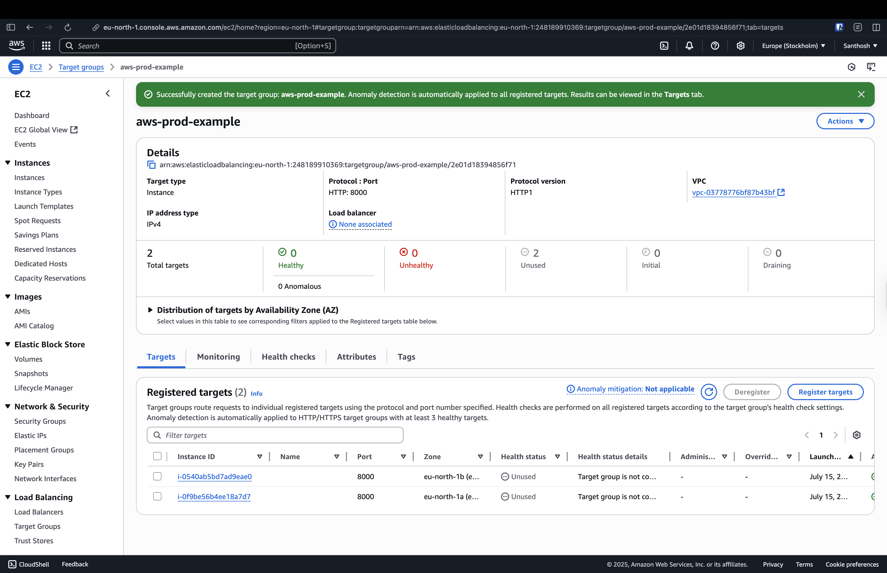
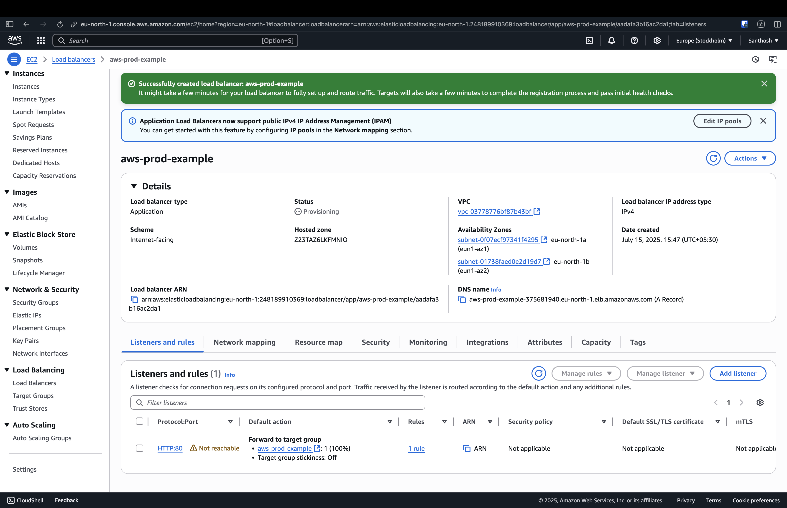

## ⚠️ Fixing Port 80 Issue

Initially, ALB couldn't reach port 80 on the private EC2s. The fix:

* Updated **Security Group** to allow inbound traffic on port 80
* Now both EC2s became reachable

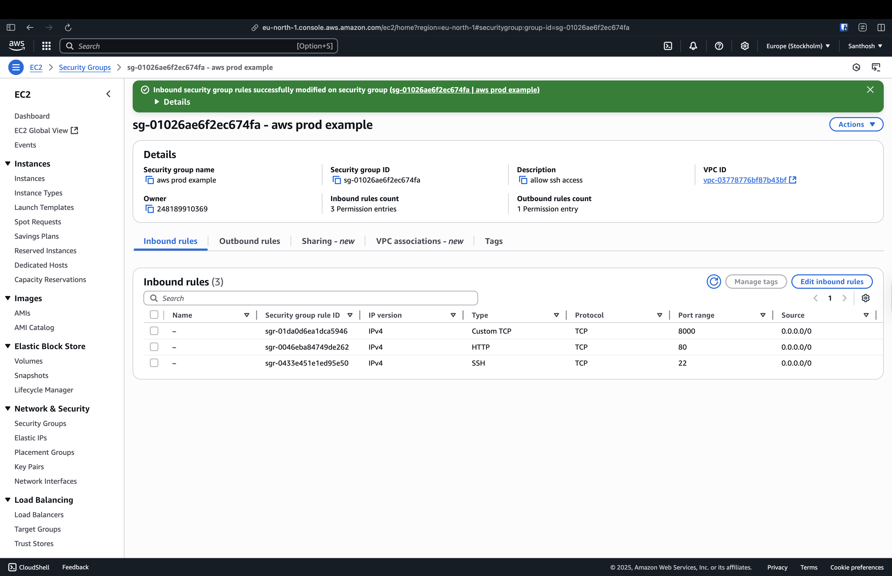

* Added both EC2 instances from the Auto Scaling Group
* Configured **health check** on port 80 and path `/`

Accessed the ALB URL:

```
http://aws-prod-example-375681940.eu-north-1.elb.amazonaws.com
```

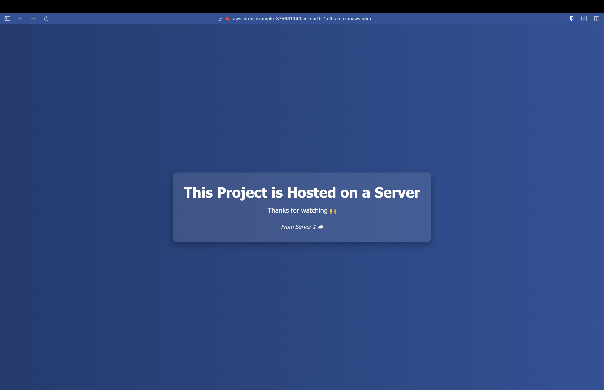

### Result:

* Even though AZ B has no server, the page **always worked** ✅
* Why? Because the Load Balancer’s health check detected only AZ A is healthy and routed traffic there

---

## 🧠 Why Load Balancer Worked Even When AZ B Had No Page?

This is due to the **health check mechanism**:

* ALB checks whether each EC2 instance responds correctly to a specific path/port
* If a target fails, ALB **removes it from rotation**
* Only healthy targets get traffic — that’s why the page kept loading from AZ A

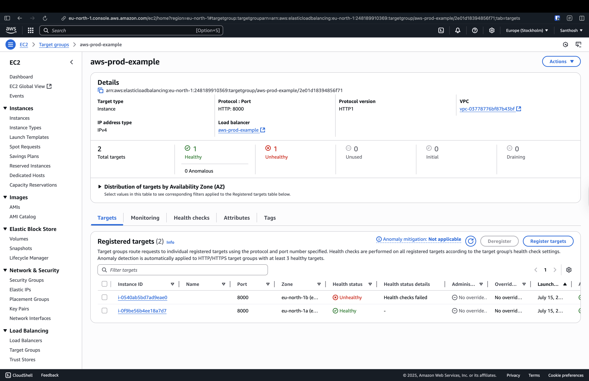

---

## 🧪 Testing with Second Instance (AZ B)

* Deployed the same Python web server on the EC2 in AZ B:

```bash
python3 -m http.server 8000
```


* Health check passed ✅ for both EC2s

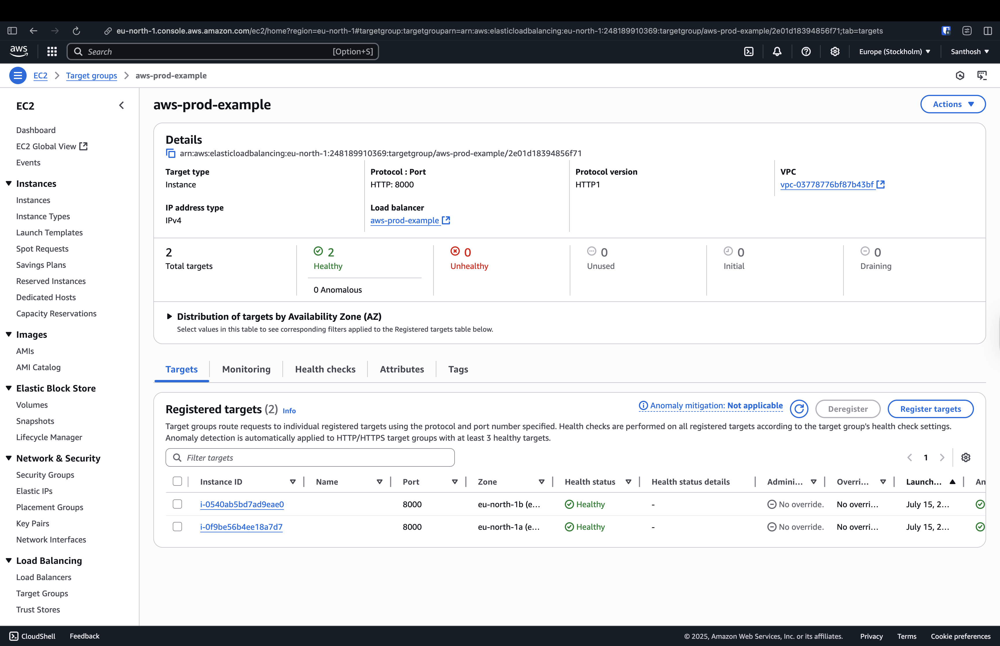

* Accessed ALB URL again — now it started rotating traffic between AZ A and AZ B

**Verified by observing:**

* Some requests responded from Server 1 (AZ A)


* Others from Server 2 (AZ B)

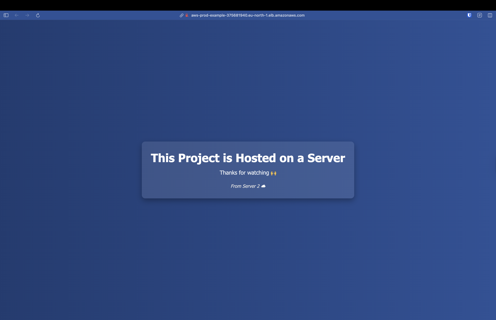

---

## 🎉 Success

* Fully functional infrastructure with:

  * Secure private EC2s
  * Jump host access
  * Auto Scaling Group
  * Load Balancer with smart health checks
* Demonstrated real-world production flow ✅

---

## 📌 Notes

* You can turn off health checks to force ALB to route to all instances, even broken ones (not recommended)
* This simulates how real-world infrastructure reroutes traffic from failed servers to healthy ones
* Use this flow as a base for CI/CD, container deployments, or monitoring stack setups
